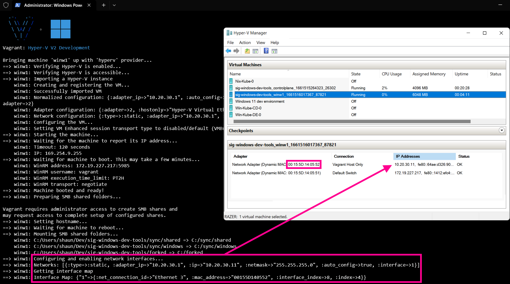

# Hyper-V Update

I've hacked together something that works for a start because I've been wanting Vagrant to work more seamlessly with Hyper-V for a long time.  
I'm just replicating the Virtualbox behaviour as close as possible so Vagrantfiles behave similarly on Hyper-V and VirtualBox.  
🙏 In an ideal world this would get rid of the primary limitation on https://www.vagrantup.com/docs/providers/hyperv/limitations

## Done
 - Get a basic equivalent of the VirtualBox NAT adaptor connected by default to any machine so it has an internet connection.
 - Connect an additional host-only network adapter with configurable static IP address.  
 - In theory bridged adapters should work but I haven't tested it yet because I've just been trying to get 
## To-do
 - Version the provider so it can be opt-in.
 - Provision vm adapters on demand instead of creating some templated solutions for host-only and bridged adapters. This would allow multiple private networks on a single VM.
 - Clean up all my debug cruft.

# Vagrant

- Website: [https://www.vagrantup.com/](https://www.vagrantup.com/)
- Source: [https://github.com/hashicorp/vagrant](https://github.com/hashicorp/vagrant)
- HashiCorp Discuss: [https://discuss.hashicorp.com/c/vagrant/24](https://discuss.hashicorp.com/c/vagrant/24)

Vagrant is a tool for building and distributing development environments.

Development environments managed by Vagrant can run on local virtualized
platforms such as VirtualBox or VMware, in the cloud via AWS or OpenStack,
or in containers such as with Docker or raw LXC.

Vagrant provides the framework and configuration format to create and
manage complete portable development environments. These development
environments can live on your computer or in the cloud, and are portable
between Windows, Mac OS X, and Linux.

## Quick Start

Package dependencies: Vagrant requires `bsdtar` and `curl` to be available on
your system PATH to run successfully.

For the quick-start, we'll bring up a development machine on
[VirtualBox](https://www.virtualbox.org/) because it is free and works
on all major platforms. Vagrant can, however, work with almost any
system such as [OpenStack](https://www.openstack.org/), [VMware](https://www.vmware.com/), [Docker](https://docs.docker.com/), etc.

First, make sure your development machine has
[VirtualBox](https://www.virtualbox.org/)
installed. After this,
[download and install the appropriate Vagrant package for your OS](https://www.vagrantup.com/downloads.html).

To build your first virtual environment:

    vagrant init hashicorp/bionic64
    vagrant up

Note: The above `vagrant up` command will also trigger Vagrant to download the
`bionic64` box via the specified URL. Vagrant only does this if it detects that
the box doesn't already exist on your system.

## Getting Started Guide

To learn how to build a fully functional development environment, follow the
[getting started guide](https://www.vagrantup.com/docs/getting-started).

## Installing from Source

If you want the bleeding edge version of Vagrant, we try to keep main pretty stable
and you're welcome to give it a shot. Please review the installation page [here](https://www.vagrantup.com/docs/installation/source).

## Contributing to Vagrant

Please take time to read the [HashiCorp Community Guidelines](https://www.hashicorp.com/community-guidelines) and the [Vagrant Contributing Guide](https://github.com/hashicorp/vagrant/blob/main/.github/CONTRIBUTING.md).

Then you're good to go!
